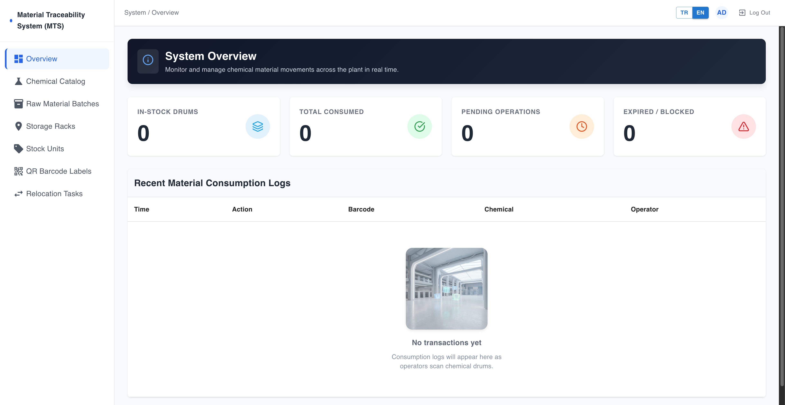
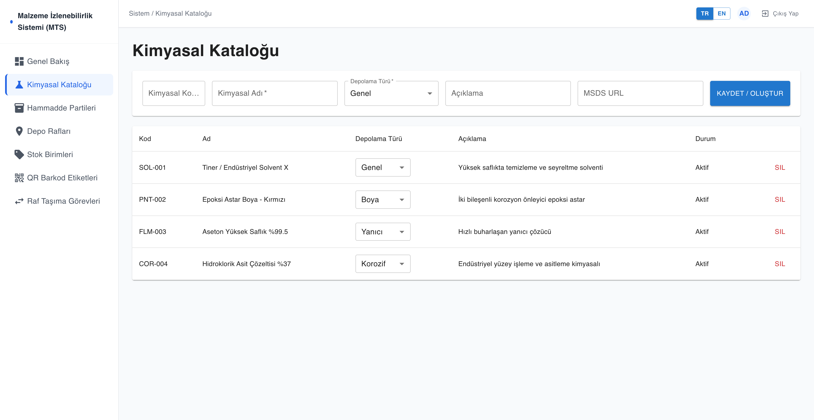
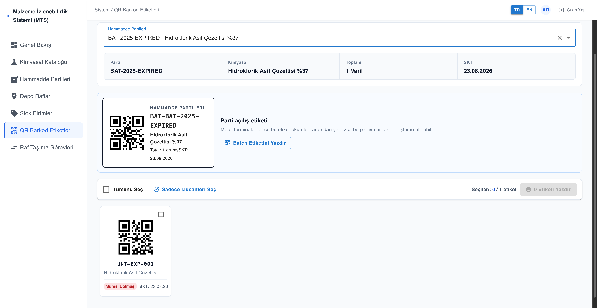
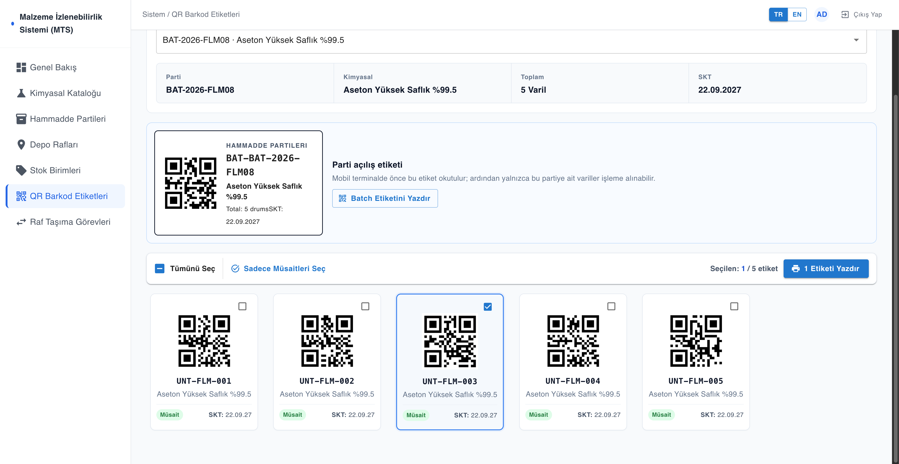
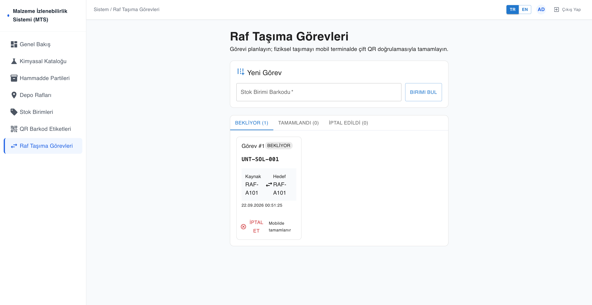
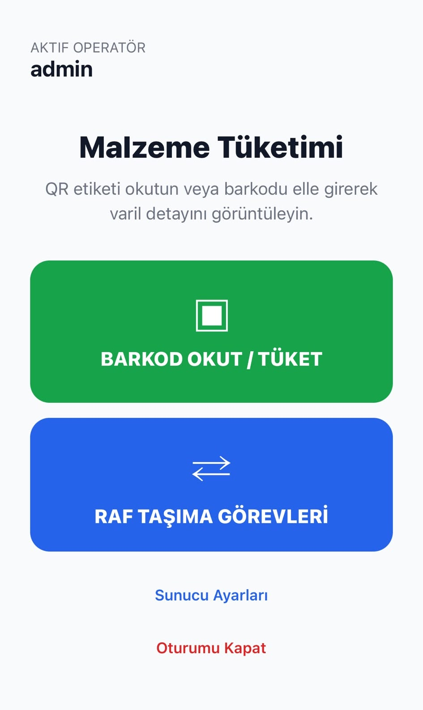

# Material Traceability System (MTS)

Material Traceability System is an end-to-end industrial Warehouse Management System (WMS) ecosystem designed for chemical inventory tracking, lot expiration monitoring, automated shelf capacity verification, dual-QR relocation workflows, and barcode-driven mobile terminal operations.

---

## 📸 Screenshots

<p align="center">
  
  
</p>

<p align="center">
  
  
</p>

<p align="center">
  
  
</p>

---

## 🏗️ Architecture & Ecosystem

```text
MaterialTraceabilitySystem/
├── backend/          .NET 10 Web API (EF Core 10, PostgreSQL 16, JWT & RBAC)
├── web-portal/       React + Vite Administration Dashboard (Material UI, Nginx)
├── mobile-terminal/  React Native + Expo Barcode Terminal (Camera & QR Scanner)
├── docs/images/      Repository screenshots and visual assets
├── docker-compose.yml Full-stack Docker orchestration
└── README.md
```

### Tech Stack
- **Backend API:** ASP.NET Core (.NET 10), C# 13, Entity Framework Core 10, PostgreSQL 16, JWT Authentication, Scalar API Docs.
- **Web Portal:** React 19, Vite, Material UI (MUI), Axios, QR Code Generation, Nginx.
- **Mobile Terminal:** React Native, Expo Router, Expo Camera, SecureStore, AsyncStorage.
- **Infrastructure:** Docker, Docker Compose, Nginx Reverse Proxy.

---

## 🚀 Quick Start with Docker Compose

Run the entire ecosystem (PostgreSQL 16, .NET 10 API, and Nginx React Portal) with a single command:

```bash
# 1. Copy environment template
cp .env.example .env

# 2. Build and start containers
docker compose up --build -d
```

### Access URLs:
- **Web Dashboard:** `http://localhost`
- **Backend API:** `http://localhost:5059/api`
- **Scalar Interactive API Docs:** `http://localhost:5059/scalar/v1`

---

## 🛠️ Run Services Individually

### 1. Backend API (.NET 10)
```bash
cd backend
dotnet restore
dotnet run
```
*Database automatically seeds default roles (`Admin`, `Operator`) and admin user (`admin` / `admin123`).*

### 2. Web Portal (React + Vite)
```bash
cd web-portal
npm ci
npm run dev
```
*Access at `http://localhost:5173` (defaults to connecting to `http://localhost:5059/api`).*

### 3. Mobile Terminal (Expo)
```bash
cd mobile-terminal
npm ci
npm start
```
*Scan the QR code with Expo Go or run on iOS Simulator / Android Emulator. Set the computer's LAN IP on the Settings screen when testing on physical devices.*

---

## 🌟 Core Features & Automated Validation Rules

- **🔐 Authentication & Authorization:** Secure JWT token authentication with 30-min access tokens, 7-day refresh tokens, and granular Admin/Operator role permissions.
- **🛑 Capacity & Storage Type Verification:** Automatic validation rules that prevent storing chemical materials on incompatible shelf types (`GENERAL`, `PAINT`, `FLAMMABLE`, `CORROSIVE`) or exceeding shelf capacity.
- **📦 Batch-First QR Scanning:** Mandatory scanning of a Batch QR (`BAT-{BatchNo}`) before consuming individual units to enforce strict lot governance.
- **🔄 Dual-QR Relocation Tasks:** Relocation tasks planned on the web dashboard require warehouse operators to scan both the physical Unit QR and the target Address QR (`ADR-{Code}`) on the mobile terminal.
- **🖨️ QR Label Printing Manager:** Searchable batch selector, batch summary cards, selectable unit grids, and `@media print` layout optimized for A4 label printing.
- **🔍 Full-Text Search:** Case-insensitive search across chemicals, batch lot numbers, suppliers, barcodes, and warehouse shelf codes.

---

## 🧪 Testing

```bash
# Web Portal Unit Tests
cd web-portal && npm test

# Mobile Terminal Unit Tests
cd mobile-terminal && npm test

# Backend Solution Build
cd backend && dotnet build
```
